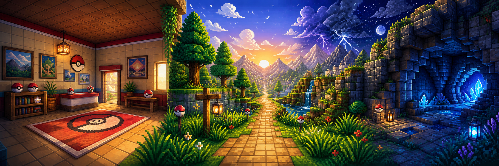
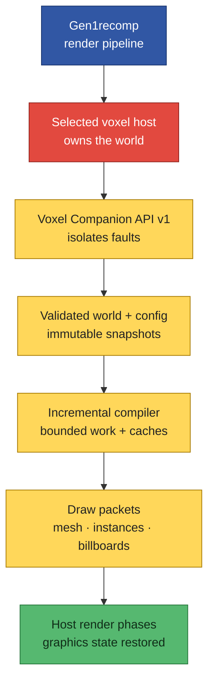
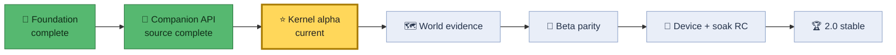

<p align="center">
  
</p>

<h1 align="center">Kanto First Person 2.0</h1>

<p align="center">
  <strong>A new point of view for the classic Kanto journey.</strong><br>
  Rooms gain depth. Caves gain roofs. Routes reach the horizon.<br>
  The voxel host stays safe and in control.
</p>

<p align="center">
  
  
  
  <a href="https://github.com/BoLayerDev/kanto-first-person/actions/workflows/ci.yml?query=branch%3Av2-rewrite"></a>
</p>

> [!IMPORTANT]
> **Trainer notice:** this is `2.0.0-alpha.1` development source, not a stable
> player release. Battle Art and Dramaless need released API v1 host adapters
> before KFP can render in a normal installation.

Kanto First Person (KFP) is a world-detail graphics overhaul for Gen1recomp voxel
hosts. It rebuilds the visual ambition of the old Interiors and Tweaks mod
without copying, patching, restoring, or deleting another mod's files.

It targets **Pokémon Red, Blue, and Yellow**. It ships no ROM data.

<p align="center"><sub>The banner is original fan art with Poké Ball-inspired motifs. It uses no game screenshot, extracted sprite, character art, or ROM-derived image.</sub></p>

## 📖 Pokédex entry

| Field | Entry |
|---|---|
| **Type** | Graphics overhaul |
| **Stage** | `2.0.0-alpha.1` source candidate |
| **Games** | Red · Blue · Yellow |
| **Engine** | Gen1recomp `>=0.2.17 <0.3.0` |
| **Hosts** | Battle Art **or** Dramaless |
| **Permissions** | None |
| **Host file access** | Never |
| **Gameplay** | Ledge Leap is hidden and forced off |

**Quick routes:** [Features](#features) · [Compatibility](#compatibility) ·
[Install and upgrade](#install) · [Architecture](#architecture) ·
[Developer guide](#development) · [Roadmap](#roadmap)

## ✨ Evolution from v1

Version 1 inserted Lua into a voxel host. Gen1recomp API 2 made that design
obsolete. Its cleanup path could also damage host files when backup state was
incomplete.

Version 2 is a clean evolution:

| v1 | v2 |
|---|---|
| Spliced host source | Calls a public host-extension API |
| Used backups and file ledgers | Owns only KFP files and resources |
| Replaced callbacks | Registers one isolated extension |
| Shared broad mutable state | Uses bounded immutable snapshots |
| Did large work in render paths | Compiles in budgeted slices |
| Used global random state | Uses deterministic local generators |
| Claimed movement was untouched | Marks gameplay effects honestly |

KFP 2 has no patcher, unpatcher, shadow copy, or `REMOVE PATCH` action.
Removing it cannot change a voxel host.

<a id="features"></a>

## 🗺️ Kanto field guide

**Legend:** 🟡 source represented · 🔵 host capability needed · 🔴 evidence
open · 🔒 unavailable in this alpha

| Area | What KFP is rebuilding | State |
|---|---|:---:|
| 🏠 **Interiors** | Walls, ceilings, cutaways, doors, windows, rails, posters, doorway light | 🟡 |
| 🪨 **Caves** | Uneven roofs, stalactites, stalagmites, pools, sconces, bats | 🟡 |
| 🌲 **Routes** | World apron, neighboring terrain, raised trees, mountains, grounded props | 🟡 |
| 🌿 **Forests** | Canopy, vines, light wells, grass, wind, insects, particles | 🟡 |
| 🌦️ **Atmosphere** | Horizons, clouds, stars, aircraft, rain, storms, fog, rainbows | 🟡 |
| 🎧 **Camera and sound** | Head bob, jump feel, doorway step, FOV, depth intent, ambient beds | 🟡 🔴 |
| 🌳 **Battle and shadows** | Battle props and corrected object shadows | 🔵 🔴 |
| 🐦 **Wildlife** | Birds and ground flocks | 🔒 |
| 🏠 **Ceiling controls** | Third-person and diorama NONE, CUTAWAY, and FULL modes; beams and roses | 🟡 🔴 |
| 💡 **Open controls** | Lamplight and debug HUD | 🔒 |
| 🦘 **Ledge Leap** | Corrected directional policy | 🔒 |

`Represented` means a ROM-free test can inspect a bounded v2 command. It does
**not** mean that real-game output has passed visual review. See the
[feature parity ledger](docs/feature-parity.md) for the full evidence record.

<a id="compatibility"></a>

## 🏅 Gym badge check

### Gen1recomp

| Target | Commit | Check |
|---|---|:---:|
| `v0.2.17` | `44f4680` | ✅ audited |
| `v0.2.18` | `70d7b6` | ✅ audited |
| `v0.2.19` | `116a6ba` | ✅ current release; audited |
| Rewrite `dev` baseline | `06e06e3` | ✅ audited |
| Current audited `dev` | `478e3bf` | ✅ audited |

### Voxel hosts

| Host | Audited base | Current adapter gate |
|---|---|---|
| `BATTLE_ART_VOXEL_FORK` | 1.9.7 at `fcbe541` | [Battle Art PR #29](https://github.com/absol89/DramaticShapeVoxelMod/pull/29), head `cee25fd`; open and mergeable |
| `DRAMALESS_SHAPE` | 2.0.3 at `f14795b` | [Dramaless PR #47](https://github.com/artyrambles/DRAMALESS_SHAPE/pull/47), head `f757544`; open and mergeable |

KFP needs **exactly one** compatible active host. Zero hosts leave it inactive.
Two hosts also leave it inactive. KFP never guesses which renderer should own
the world. Only the two hosts in this table are supported; every other host
fails closed. “Mergeable” does not mean approved, merged, or released.

Public CI covers Windows, Linux, and macOS source gates. Every other platform
remains experimental until a device owner records native evidence.

<a id="install"></a>

## 🎒 Clean installation

Use this route only after a signed KFP prerelease and an owner-released host
adapter exist:

1. Install **Battle Art or Dramaless** with its released API v1 adapter.
2. Enable exactly one voxel host.
3. In Gen1recomp, select **MODS → Import mod .zip** and choose the signed KFP
   release ZIP.
4. Enable KFP, restart Gen1recomp, and confirm API v1 attachment in the KFP
   diagnostic.

Do not use GitHub's automatic source ZIP. Never merge KFP files into a host.
To roll back, close Gen1recomp and import the prior signed KFP package again.

There is no supported public alpha package yet. Players should wait for a
tagged prerelease and matching host releases.

## 🧭 Safe migration route

Old KFP installations can leave edits inside a voxel host.

1. Close Gen1recomp.
2. Reinstall your selected voxel host from a verified clean release.
3. Replace KFP v1 with KFP v2.
4. Start Gen1recomp.
5. Check the KFP compatibility diagnostic.

> [!WARNING]
> Do not delete KFP v1 and then launch an old patched host. KFP 2 does not
> repair host files. An updated adapter only scans for old markers. If it
> finds one, it refuses registration and asks for a clean host reinstall.

Read the [complete upgrade guide](docs/upgrade-v1-to-v2.md).

<a id="architecture"></a>

## 🔗 The safe renderer link

Gen1recomp permits one active world renderer. KFP does not compete for it. The
selected host keeps `drawWorld` and calls KFP at fixed phases.



### API rules

- API major versions and required capabilities must match.
- Optional capabilities disable only related features.
- Host contexts and resources are borrowed and read-only.
- KFP retains no live host objects after a callback.
- One extension fault cannot stop the host.
- Every KFP resource has one owner and idempotent release.
- Render callbacks perform no file reads, decoding, shader compilation, or
  full-map construction.

Portable phases are `background`, `opaque_after_terrain`, and
`translucent_after_actors`. Battle, shadow, and terrain-patch work appears only
when a host advertises the matching capability.

Only a host adapter reads tile IDs or broad engine state. It copies approved
semantic facts, such as tree and mountain support roles, into the normalized
snapshot. KFP rejects unknown, walkable, and isolated supports, then applies
deterministic density for the selected quality tier. Camera output is additive;
terrain output is declarative; KFP never retains a live host object.

Read the [normative Voxel Companion API v1](docs/voxel-companion-api-v1.md)
for schemas, callback order, leases, limits, faults, and conformance fixtures.

## ⚔️ Battle stats

| Quality | Build budget | Cache | Effects | Added draw calls |
|---|---:|---:|---:|---:|
| **High** | 2.0 ms/frame | 128 MiB | 100% | ≤ 48 |
| **Balanced** | 1.0 ms/frame | 64 MiB | 60% | ≤ 32 |
| **Low** | 0.5 ms/frame | 32 MiB | 30% | ≤ 20 |

`AUTO` follows the host tier. Stable release still needs CPU p95, scene-ready
latency, draw-call, 30-minute heap, and 100-map-transition resource evidence.

## 💾 Move reminder: option migration

KFP keeps mod ID `ds_fp_ceiling` so all 53 unique v1.60 keys can migrate.

- Old `shadows` becomes `contact_shadows` only.
- `object_shadows` receives its own corrected default.
- `fastchunks=false` becomes Low quality.
- `fastchunks=true` or missing becomes Auto.
- `REMOVE PATCH` is retired.
- Jump key and gamepad bindings are retained.
- Migration never enables Ledge Leap.

See the [complete option table](docs/options-migration.md).

## 🔒 Locked move: Ledge Leap

Ledge Leap changes gameplay, so `affects_link=true` remains honest.

The alpha contains a corrected, tested policy but installs no input hook and
queues no movement. The feature stays hidden until Gen1recomp exposes one
atomic public movement attempt that owns collision, scripts, actors, warps,
ledge direction, and side effects.

The old “jump from any side” and “bounce elsewhere” behavior will not return.

<a id="development"></a>

## 🧪 Professor's lab

Run the public gates:

```text
luajit tools/check_syntax.lua
luajit tools/validate_project.lua
luajit tools/run_tests.lua
luajit tools/run_benchmarks.lua
python -m unittest discover -s tests/tools -p "test_*.py" -v
```

GitHub Actions repeats these gates across Windows, Linux, macOS, and every
audited engine target. Use the CI badge and machine-readable release ledger for
the current immutable result; README test counts are intentionally not cached.

Strict engine checks:

```text
python <gen1recomp>/tools/modkit.py validate --strict --base fixture .
python <gen1recomp>/tools/modkit.py lint .
```

| Code area | Responsibility |
|---|---|
| `companion/` | Host-neutral API dispatcher |
| `src/companion/` | Host selection and normalized snapshots |
| `src/core/` | Loader, diagnostics, scheduler, cache, ownership |
| `src/render/` | Packet schema, hashes, quality, compiler |
| `src/features/` | World, weather, flora, camera, audio intent |
| `src/config/` | Immutable options and v1 migration |
| `src/gameplay/` | Dormant Ledge Leap policy |
| `tests/` and `tools/` | ROM-free verification and packaging |

The deterministic package tool accepts only audited engine commits, copies
only approved Git-visible runtime files, rejects unsafe or private content,
and writes a ZIP, `.modpkg`, hashes, and attestation.

Public alpha, beta, RC, and stable packages each require a signed tag and a
channel-specific approved gate ledger. Asset redistribution permission is a
hard gate for every channel. See the [release process](docs/release-process.md)
and [creator permission template](docs/asset-permission-request-template.md).

<a id="roadmap"></a>

## 🏆 Badge quest to 2.0



The alpha ledger is not approved. Asset rights are recorded complete; released
host adapters, Red/Blue/Yellow GPU review, native-device results, soak and leak
evidence, reproducibility, signing, and community review remain gated. Any open
required gate keeps the project prerelease. See the exact
[machine-readable gates](docs/prerelease-gates.json).

## 📚 Professor's notes

| Topic | Record |
|---|---|
| Architecture | [System design](docs/architecture.md) |
| Host API | [Voxel Companion API v1](docs/voxel-companion-api-v1.md) |
| Compatibility | [Engine, host, game, and platform matrix](docs/compatibility.md) |
| Features | [Parity and evidence ledger](docs/feature-parity.md) |
| Settings | [Option migration](docs/options-migration.md) |
| Upgrade | [Safe v1-to-v2 route](docs/upgrade-v1-to-v2.md) |
| Performance | [Benchmark method](docs/benchmark-method.md) |
| Runtime QA | [Scene, lifecycle, and soak matrix](docs/qa-matrix.md) |
| Device evidence | [Device-owner test guide](docs/device-test-guide.md) |
| Known limits | [Alpha limitations](docs/known-limitations.md) |
| Release | [Machine-readable gates](docs/release-gates.json) |
| Release process | [Signing, packages, and publication](docs/release-process.md) |
| Asset rights | [Redacted approval record](docs/rights-approval.json) |
| Permission template | [Creator permission request](docs/asset-permission-request-template.md) |
| Milestones | [Roadmap](ROADMAP.md) |
| Recovery | [Project status](PROJECT_STATUS.md) |

## 📜 Rights, credits, and Poké Ball fine print

Independently authored v2 source is MIT licensed. Legacy panoramas, posters,
audio, and legacy-derived cloud textures remain outside MIT and are covered by
a separate express creator grant. Only its redacted hash-bound approval record
is public; the signed original stays private.

Never commit or package ROMs, saves, imported cache content, ROM-derived PNG
files, credentials, or private evidence. See
[Third-Party Notices](THIRD_PARTY_NOTICES.md) and [Security](SECURITY.md).

KFP exists because Gen1recomp and its voxel-host community made a first-person
Gen 1 world possible. This rewrite keeps the link safe: one host-owned
renderer, one public contract, and no cross-mod file mutation.

This is an independent fan project. It is not affiliated with or endorsed by
Nintendo, Game Freak, Creatures, or The Pokémon Company.
