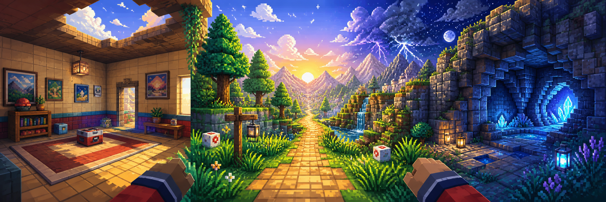
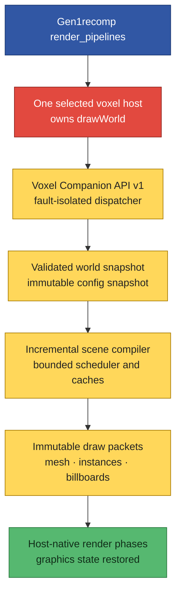

<p align="center">
  
</p>

<h1 align="center">Kanto First Person 2.0</h1>

<p align="center">
  <strong>A clean, sandbox-safe world-detail companion for Gen1recomp voxel hosts.</strong>
</p>

<p align="center">
  
  
  
  
  <a href="https://github.com/BoLayerDev/kanto-first-person/actions/workflows/ci.yml?query=branch%3Av2-rewrite"></a>
</p>

> [!IMPORTANT]
> **This repository contains `2.0.0-alpha.1` development source.** It is not a
> stable end-user release. Battle Art and Dramaless need released companion
> adapters before KFP can render in a normal installation.

Kanto First Person (KFP) rebuilds the visual ambition of the old Interiors and
Tweaks mod without its source patcher. The voxel host still owns the world
renderer. KFP connects through a small public API and supplies bounded scene
commands for interiors, caves, landscape detail, atmosphere, camera motion,
and audio.

The rewrite targets **Pokémon Red, Blue, and Yellow**. It ships no ROM data and
does not read or change another mod's files.

<p align="center"><sub>Hero art is original project artwork. It contains no game screenshot, official character, or ROM-derived image.</sub></p>

## At a glance

| | Current truth |
|---|---|
| **Release stage** | `2.0.0-alpha.1` source-integration candidate |
| **Games** | Red, Blue, and Yellow |
| **Engine range** | Gen1recomp `>=0.2.17 <0.3.0` |
| **Voxel hosts** | Battle Art or Dramaless; exactly one active host |
| **Runtime permissions** | None |
| **Host file access** | Never |
| **Gameplay changes** | Ledge Leap is hidden and forced off in this alpha |
| **Stable release** | Blocked by host, GPU, parity, rights, device, and soak gates |

**Start here:** [Upgrade safely](#safe-upgrade-from-v1) ·
[See the architecture](#architecture) ·
[Read the API contract](docs/voxel-companion-api-v1.md) ·
[Check feature evidence](docs/feature-parity.md) ·
[View the roadmap](ROADMAP.md)

## Why version 2 exists

The original mod inserted Lua into a voxel host. Gen1recomp's API 2 sandbox
made that design obsolete. The old cleanup path could also damage host files
when its backup state was incomplete.

Version 2 is a clean companion rewrite.

| Legacy design | KFP 2.0 design |
|---|---|
| Spliced source into a host | Calls a public, versioned companion API |
| Copied, restored, or deleted host files | Never reads or changes host files |
| Used patch ledgers and shadow files | Owns only its own resources and storage |
| Replaced or wrapped callbacks | Registers one isolated extension descriptor |
| Shared broad mutable engine state | Uses bounded immutable snapshots |
| Rebuilt large work in render paths | Compiles scenes in budgeted main-thread slices |
| Hid some recurring errors | Emits one bounded diagnostic and quarantines the failed extension |
| Used global random state | Uses deterministic local generators |
| Claimed movement was untouched | Marks gameplay effects honestly and keeps Ledge Leap off |

Deleting KFP 2 cannot edit, repair, restore, or remove a voxel host. There is
no patch action and no `REMOVE PATCH` option.

## The world KFP is rebuilding

The old README described a richer first-person Kanto: complete rooms, cave
roofs, distant terrain, weather, forest canopies, ambient sound, and more
weight in the camera. Version 2 keeps that direction, but it separates source
intent from verified output.

### 🏠 Interiors

- Synthesized walls and ceilings with Airy, Mid, and Snug headroom.
- Cutaway and full ceiling intent for supported camera modes.
- Single and double doors, windows, rails, skirting, and doorway light.
- General, Center, and Mart poster sheets.
- Contact shadows and capability-gated fittings or light effects.

### 🪨 Caves

- Uneven cave roofs, stalactites, stalagmites, and rock columns.
- Pools, sconces, and bat intent with bounded batches.
- Deterministic placement from normalized map facts.

### 🌲 Routes, forests, and towns

- A terrain apron that closes the world edge without changing map data.
- Neighbor-aware landscape intent, raised trees, mountains, and grounded props.
- Forest canopy, hanging vines, light wells, grass, wind, insects, and particles.
- Shore and water-edge effects without a render-time full-map scan.

### 🌦️ Sky and atmosphere

- Four horizon choices, cloud layers, stars, twinkle, and shooting-star intent.
- Aircraft, rain, storms, lightning, umbrellas, puddles, splashes, and rainbows.
- Lavender fog and day-or-night atmosphere.
- Local deterministic clocks and seeds. KFP never calls `math.randomseed`.

### 🎧 Camera and sound

- Optional head bob, jump feel, doorway step, and bounded field-of-view deltas.
- Depth-effect intent when the host exposes the needed capability.
- Ambient beds and one-shot source ownership with fixed pools.
- Packaged legacy audio stays blocked until redistribution rights are proven.

## Feature evidence, not marketing claims

`Represented` means ROM-free tests can inspect a bounded v2 command or policy.
It does **not** mean that real-game output has passed visual review.

| Area | Source state | What is still open |
|---|---|---|
| Interiors and doors | Represented | Host rendering, placement, cutaway, and screenshot corpus |
| Cave geometry and pools | Represented | Animation, tilesets, lighting, and GPU review |
| World apron, trees, and mountains | Represented | Connected-map semantics and Red/Blue/Yellow placement |
| Sky, weather, and forest systems | Represented | Timing, batching, photosensitivity, and visual acceptance |
| Birds and ground flocks | Open | No public runtime resolver or executable packet yet |
| Camera and audio intent | Represented | Event routing, rights, host projection, and device review |
| Battle props and object shadows | Capability-gated | Released host phases and real alpha/GPU evidence |
| Third-person ceiling, lamplight, debug HUD | Open | No alpha runtime consumer; options stay hidden |
| Ledge Leap | Unavailable | Needs one safe atomic public movement-attempt API |

For every feature decision, see the
[feature parity ledger](docs/feature-parity.md).

## Compatibility

### Engine

| Target | Audited commit | State |
|---|---|---|
| Gen1recomp `v0.2.17` | `44f4680` | Minimum supported version; CI passes |
| Gen1recomp `v0.2.18` | `70d7b6` | Latest audited stable version; CI passes |
| Rewrite baseline `dev` | `06e06e3` | Pinned compatibility check passes |
| Current audited `dev` | `087a275` | Pinned compatibility check passes |

### Voxel hosts

| Host ID | Audited source | Adapter state |
|---|---|---|
| `BATTLE_ART_VOXEL_FORK` | 1.9.7 at `fcbe541` | Local contract suite passes; owner review and GPU run open |
| `DRAMALESS_SHAPE` | 2.0.3 at `f14795b` | Local contract suite passes; owner review and GPU run open |

KFP requires **exactly one** compatible active host. With zero hosts, it stays
inactive. With more than one, it also stays inactive and reports the
ambiguity. It never guesses which renderer should own the frame.

### Platforms

Public CI covers Windows, Linux, and macOS source gates. Android, iOS, Xbox
UWP, Nintendo Switch, PortMaster-class hardware, and Anbernic stock OS remain
experimental until device owners record native evidence.

## Safe upgrade from v1

Old KFP installations can leave source edits inside a voxel host. Use this
order:

1. Close Gen1recomp.
2. Reinstall your selected voxel host from a verified clean release.
3. Replace KFP v1 with KFP v2.
4. Start Gen1recomp.
5. Check the KFP compatibility diagnostic.

> [!WARNING]
> Do not delete KFP v1 and then launch an old patched host. KFP 2 will not
> delete or repair host files. An updated host adapter only scans for known
> legacy markers. If it finds one, it refuses registration and asks you to
> reinstall the host.

Read the [complete v1-to-v2 upgrade guide](docs/upgrade-v1-to-v2.md).

## Installation status

There is no supported public alpha package yet. The required host adapters are
local implementation evidence, not released host versions. End users should
wait for a tagged prerelease and matching host releases.

Developers can review the `v2-rewrite` branch and run the ROM-free gates below.
Do not copy the old v1 installation, patch, removal, or “drop in custom art”
instructions. They do not apply to version 2.

## Architecture

Gen1recomp permits one active world renderer. KFP does not register a competing
`drawWorld` pipeline. The selected voxel host keeps ownership and calls KFP at
fixed phases.



If KFP fails, the host continues. If the host fails, Gen1recomp keeps its own
fallback behavior.

### Runtime lifecycle

1. `main.lua` creates a sandbox-safe loader with `mod:read()` and sandboxed
   `load()`.
2. The composition root creates diagnostics, config, resource owners,
   features, the scene compiler, and the companion client.
3. The client discovers only Battle Art and Dramaless providers.
4. It selects exactly one provider with every required capability.
5. The host supplies normalized world, draw, quality, and integrity services.
6. World or option changes create a new immutable generation.
7. The compiler builds a replacement scene in bounded slices.
8. A completed packet replaces the old packet atomically.
9. Invalidation or shutdown releases each KFP-owned resource once.

The host keeps drawing its last valid scene while KFP builds a replacement.
Render callbacks do not read files, decode images, compile shaders, scan the
whole map, or build a complete scene.

### Portable render phases

| Phase | Intended work |
|---|---|
| `background` | Horizon, sky, stars, clouds, distant atmosphere |
| `opaque_after_terrain` | Interior, cave, terrain-edge, canopy, and solid prop work |
| `translucent_after_actors` | Weather, particles, fog, vines, and transparent effects |

Shadow, battle, and terrain-patch work is optional. KFP emits it only when the
provider advertises the exact capability.

<details>
<summary><strong>Voxel Companion API v1</strong></summary>

Each host exports the same discovery surface:

```lua
provider.exports.voxel_companion = {
  api = 1,
  host = { id = "...", version = "..." },
  capabilities = {
    world_snapshot = 1,
    camera_delta = 1,
    render_phases = 1,
    quality_tier = 1,
    integrity_status = 1,
  },
  register = function(spec)
    -- Returns an idempotent disposable handle, or nil plus an error.
  end,
}
```

The extension descriptor can supply `attach`, `worldChanged`, `update`,
`modifyCamera`, `invalidate`, `dispose`, and negotiated render callbacks.

Core rules:

- API major versions must match.
- Required capabilities decide compatibility.
- Missing optional capabilities disable only related work.
- Host contexts and resources are borrowed and read-only.
- KFP does not retain live host objects after a callback.
- Camera changes are finite additive deltas in documented units.
- Host graphics state is isolated around every extension call.
- One extension fault does not stop the host or another extension.
- Fault cleanup cannot re-enter dispatch, registration, or disposal.
- Every created resource has one owner and idempotent release.

The [normative API document](docs/voxel-companion-api-v1.md) defines callback
order, leases, schemas, validation, limits, faults, and conformance fixtures.

</details>

<details>
<summary><strong>World snapshot and draw-packet boundary</strong></summary>

Only host adapter code can inspect broad engine state. It publishes a bounded
plain-data view with map identity, revisions, bounds, current and neighboring
terrain, stable tags, player pose, actors, and render mode.

KFP rejects sparse, cyclic, oversized, or malformed data before scene
compilation. Functions, metatables, host objects, and borrowed resources cannot
enter a retained snapshot.

Portable draw schema v1 permits `mesh`, `instances`, and `billboards`. Each
sealed command has a deterministic cache key and canonical content digest. A
host caches its own compiled resource by copied key and digest. It does not
retain the KFP command table. Reusing one key with different content fails
closed.

</details>

## Performance model

KFP performs graphics creation and release on the main thread. Scene work is
incremental, cancellable, bounded by quality tier, and swapped atomically.

| Tier | Build budget | Cache cap | Effect density | Added draw-call target |
|---|---:|---:|---:|---:|
| **High** | 2.0 ms/frame | 128 MiB | 100% | 48 or fewer |
| **Balanced** | 1.0 ms/frame | 64 MiB | 60% | 32 or fewer |
| **Low** | 0.5 ms/frame | 32 MiB | 30% | 20 or fewer |

`AUTO` follows the host quality tier. Final release also requires scene-ready
latency, CPU p95, draw-call, 30-minute heap, and 100-map-transition resource
evidence. Source design alone does not pass those gates.

## Options and migration

KFP keeps the mod ID `ds_fp_ceiling` so stored settings can migrate. The
migration accounts for all 53 unique keys from the published 1.60 archive.

Important corrections:

- Old `shadows` maps only to `contact_shadows`.
- `object_shadows` receives a separate corrected default.
- `fastchunks=false` maps to Low quality.
- `fastchunks=true` or missing maps to Auto quality.
- `REMOVE PATCH` is retired and can never run file cleanup.
- Old keyboard and gamepad jump bindings are retained.
- Migration never enables Ledge Leap.
- Invalid live values keep the last safe stored value.

See the [complete option migration table](docs/options-migration.md).

## Ledge Leap

Ledge Leap changes gameplay, so the manifest keeps `affects_link=true`.

The rewrite contains a corrected pure policy and input-binding tests. The alpha
does **not** install an input hook, retain movement facts, or queue movement.
The option is hidden and forced off until Gen1recomp provides one synchronous,
atomic public movement attempt that owns current collision, scripts, actors,
warps, ledge direction, and side effects.

The old “jump from any side” and “bounce elsewhere” behavior will not return.

## Development

### Public verification

```text
luajit tools/check_syntax.lua
luajit tools/validate_project.lua
luajit tools/run_tests.lua
luajit tools/run_benchmarks.lua
python -m unittest tests.tools.test_package_release -v
```

The current public suite contains **215 ROM-free Lua tests**, **77 Lua syntax
checks**, and **8 release-control tests**. GitHub Actions runs the source suite
on Windows, Linux, and macOS and validates all four pinned Gen1recomp targets.

Strict engine checks:

```text
python <gen1recomp>/tools/modkit.py validate --strict --base fixture .
python <gen1recomp>/tools/modkit.py lint .
```

<details>
<summary><strong>Repository map</strong></summary>

| Path | Responsibility |
|---|---|
| `main.lua` | Minimal API 2 entry and composition root |
| `companion/` | Host-neutral API v1 reference dispatcher |
| `src/bootstrap/` | App lifecycle, dependencies, and engine facade |
| `src/companion/` | Provider selection and normalized world snapshots |
| `src/config/` | Immutable options and legacy migration |
| `src/core/` | Loader, diagnostics, RNG, scheduler, LRU, ownership, lifecycle |
| `src/render/` | Command schema, hashing, quality, compiler, submission |
| `src/features/` | World, atmosphere, weather, flora, camera, and audio intent |
| `src/gameplay/` | Dormant Ledge Leap policy and input tests |
| `src/assets/` | Packaged texture ownership and derived-asset limits |
| `src/audio/` | Stream and one-shot source ownership |
| `tests/` | ROM-free unit, contract, property, and integration tests |
| `tools/` | Syntax, policy, benchmark, and package controls |
| `docs/` | Architecture, compatibility, migration, evidence, and release records |

</details>

### Deterministic packaging

The release wrapper accepts only audited engine commits. It archives the
engine tool from that commit into isolated staging, copies only approved
Git-visible runtime files, rejects unsafe paths and private content, runs
strict validation and ROM lint, and writes a root ZIP, `.modpkg`, hashes, and
attestation with `SOURCE_DATE_EPOCH`.

```text
python tools/package_release.py \
  --engine "<pinned-gen1recomp>" \
  --output-dir "<outside-project-directory>" \
  --epoch <unix-time> \
  --allow-dirty
```

`--allow-dirty` always creates a private, non-publishable test build. Release
mode builds from a verified signed tag after every machine-readable gate has
passed.

## Release path

```mermaid
flowchart LR
    F["Foundation<br/>complete"] --> A["Companion API<br/>source complete"]
    A --> K["Kernel alpha<br/>current"]
    K --> S["Static world<br/>evidence"]
    S --> D["Dynamic world<br/>evidence"]
    D --> B["Beta<br/>full corrected parity"]
    B --> R["Release candidate<br/>devices and soak"]
    R --> V["2.0.0 stable<br/>signed and reproducible"]

    classDef done fill:#56b870,color:#102d18,stroke:#26753b;
    classDef current fill:#ffd75a,color:#222,stroke:#a77a00,stroke-width:3px;
    classDef future fill:#e9eef8,color:#24324a,stroke:#8ba0c7;
    class F,A done;
    class K current;
    class S,D,B,R,V future;
```



Stable `2.0.0` still requires:

- Released and reviewed Battle Art and Dramaless adapters.
- Real GPU acceptance for Red, Blue, and Yellow.
- Corrected 1.60 visual parity.
- Clear modification and redistribution rights for legacy assets.
- Native evidence for every claimed platform.
- Performance and resource-leak soak results.
- Reproducible tagged packages and uninstall-integrity evidence.
- Community review and a fresh engine audit.

If one required gate remains open, the project stays prerelease.

## Rights and ROM boundary

Independently authored v2 source is licensed under MIT. Legacy panoramas,
posters, and audio are outside that grant. They cannot ship publicly until
durable evidence proves modification and redistribution rights.

Never commit or package ROMs, saves, imported cache content, ROM-derived PNG
files, credentials, private permission records, or private device evidence.
The bird transform is only a recipe. It derives frames on the player's machine
from that player's own imported cache.

See [Third-Party Notices](THIRD_PARTY_NOTICES.md) and the
[security policy](SECURITY.md).

## Project documents

| Topic | Document |
|---|---|
| Architecture and ownership | [Architecture](docs/architecture.md) |
| Host contract | [Voxel Companion API v1](docs/voxel-companion-api-v1.md) |
| Engine, game, host, and platform state | [Compatibility matrix](docs/compatibility.md) |
| Preserved, corrected, retired, and open behavior | [Feature parity ledger](docs/feature-parity.md) |
| All legacy option mappings | [Option migration](docs/options-migration.md) |
| Safe v1 removal and v2 upgrade | [Upgrade guide](docs/upgrade-v1-to-v2.md) |
| Performance test method | [Benchmark method](docs/benchmark-method.md) |
| Machine-readable stable blockers | [Release gates](docs/release-gates.json) |
| Milestones | [Roadmap](ROADMAP.md) |
| Current recovery truth | [Project status](PROJECT_STATUS.md) |
| Contribution rules | [Contributing](CONTRIBUTING.md) |

## Credits

KFP exists because Gen1recomp and its voxel-host community made a first-person
Gen 1 world possible. Version 2 focuses on a safe boundary between those
projects: one host-owned renderer, one public contract, and no cross-mod file
mutation.

This is an independent fan project. It is not affiliated with or endorsed by
Nintendo, Game Freak, Creatures, or The Pokémon Company.
